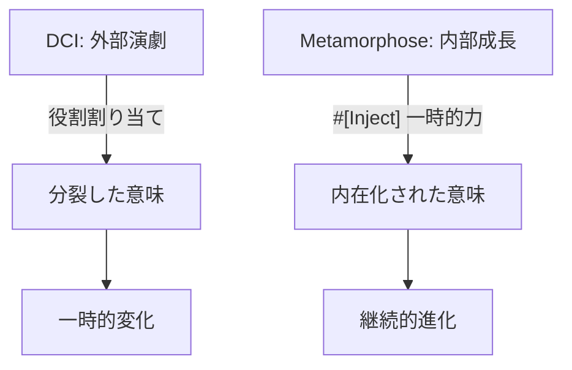

# 存在論的変容 vs. DCI：比較哲学的考察

> *「DCIでは役割は演劇の俳優のように割り当てられる；変容では、存在は生物のように進化する—意味を内在化して次の自己となる。」*

## 序文：変化と意味の対照的パラダイム

この文書は、変容（Metamorphose）パラダイムとDCI（Data-Context-Interaction）の比較を通じて、**変化の哲学**における根本的な相違を明らかにする画期的な考察である。単なる技術的比較を超えて、**意味の所在**と**変化の本質**に関する深遠な哲学的問題を扱っている。

## 核心的区別：外部割り当て vs. 内部融合

### DCIの演劇的世界観

DCIは世界を演劇として見る：不変のData（データ）がContext（文脈）内でRole（役割）を割り当てられ、Interaction（相互作用）を行う。これは**一時的な側面の捉え方**である。

### Metamorphoseの生物学的世界観

変容は世界を生物学的として見る：不変の存在段階が`$being`を通じて運命を発見し、`#[Inject]`が一時的な力を注入し、その結果が本質的に埋め込まれる。

### 意味の分裂 vs. 内在化

この対比は**意味の哲学**における重要な分岐点を示している：

- **DCI**: 相互作用から意味が生まれるが、役割割り当ては外部的—文脈間で分裂し、エピソード的な演劇のよう
- **Metamorphose**: 意味が自己の属性に蓄積し、存在と変化を次の形態に燃焼させる—生命の蓄積された経験のよう

内在化の欠如：
- DCIは分離した物語、一時的な変化のリスクを負う
- 変容は連続性を保証し、意味は炎の持続する熱となる

## パラダイム比較：空間-時間の転換

この比較分析は**プログラミングパラダイムの進化史**における重要な洞察を提供している：

DCIは空間（OO構造）から時間（文脈的役割）へと部分的に転換するが、外部制御を保持する。

変容は時間を完全に受け入れる：問題の流れが本質的に展開する。



## ユーザーフロー例：登録からアーカイブまで

### Metamorphose：内在化された進化

この例は、変容パラダイムの**意味の内在化**プロセスを完璧に示している：

```php
#[Be([ActiveUser::class, SuspendedUser::class])]
final class ValidatedUser {
    public function __construct(
        #[Input] string $email,
        #[Input] string $password,
        #[Inject] ActivationService $activator  // 一時的：役割のような力
    ) {
        $result = $activator->activate($email);  // 使用 & 内在化
        $this->activationInsight = $result->deriveMeaning();  // 意味の埋め込み
        $this->being = $result->successful 
            ? new ActiveUser($this->activationInsight) 
            : new SuspendedUser($result->reason);
    }
    public readonly string $activationInsight;  // 意味が持続
    public readonly ActiveUser|SuspendedUser $being;
}
```

重要なのは、`$this->activationInsight = $result->deriveMeaning()`という行だ。これは**経験の内在化**を表現している。外部サービスとの相互作用の結果が、単なる状態変更ではなく、**内在的な洞察**として組み込まれる。

### DCI：外部役割演技

対照的に、DCIアプローチでは：

```php
class ValidationContext {
    public function __construct(UserData $user, ActivationService $service) {
        $user->addRole(new ActivationRole($service));  // 外部割り当て
        $user->activate();  // 相互作用：役割からの意味
    }
}

class ActivationRole {
    public function activate(UserData $self) {
        $result = $this->service->activate($self->email);
        $self->insight = $result->meaning;  // 外部からの意味追加
    }
}
```

意味がDataに追加されるが、流れが文脈間で分裂する。これは**意味の外在性**を示している。

## 哲学的含意：演劇 vs. 成長

### DCIの演劇的限界

DCIの「外部演劇」モデルは重要な限界を持つ：
- 役割が実行され、意味がエピソード的
- 部分的な「生きている」答え：側面のための役割

### Metamorphoseの生物学的優位性

変容の「内部成長」モデルは質的に異なる：
- 力は一時的だが、結果は本質的
- 完全な融合：存在が意味に燃料を供給された変化に燃焼する

「DCIはOOを昇格させる；変容は超越し、生命の内在化された進化を反映する」という比較は、両パラダイムの根本的性格を明確にしている。

## 中核的洞察：燃焼する存在

### 「燃焼」の比喩の深遠さ

「Metamorphose's growth burns eternally」（変容の成長は永遠に燃焼する）という表現は詩的だが、深い哲学的意味を持つ。

燃焼とは：
1. **変容的プロセス** - 物質が別の形態に変化する
2. **エネルギー放出** - 光と熱を生成する
3. **不可逆的** - 元の状態には戻れない
4. **連続的** - 燃料がある限り持続する

変容パラダイムでは、**意味が燃料**となって存在を次の段階に変容させ続ける。これは単なる状態遷移ではなく、**存在の燃焼**である。

### 内在化の優位性

```php
// 変容：意味が内在化される
$this->activationInsight = $result->deriveMeaning();

// DCI：意味が外部から付加される  
$self->insight = $result->meaning;
```

この微細な違いが、実は**哲学的な深淵**を表している。前者は**体験の内在化**、後者は**情報の付加**である。

## 結論：役割演技を超えて燃焼する存在へ

「役割を割り当てるDCI；運命になる変容—次の自己への道を照らすために意味を内在化する」という最終的な対比は、両パラダイムの本質的相違を詩的に表現している。

### 進化の方向性

この比較は、プログラミングパラダイムの**進化の必然性**を示している：

1. **OOP**: 静的構造
2. **DCI**: 動的役割（部分的時間性）
3. **Metamorphose**: 内在的進化（完全時間性）

各段階は前段階を包含し、かつ超越する。

### 生きたプロセスとしてのパラダイム

「パラダイムを生きたプロセスとして再定義する」という視点は革命的だ。パラダイム自体が**生きて成長するもの**として捉えられる。

## 総合考察：意味の哲学

この文書の真の価値は、**意味の所在**という哲学的問題を技術的実装の違いを通じて明確にしていることである。

### 外在的意味 vs. 内在的意味

DCIとMetamorphoseの違いは、究極的には**意味の哲学**における根本的立場の違いである：

- **DCI**: 意味は関係性にある（外在的意味論）
- **Metamorphose**: 意味は存在に内在する（内在的意味論）

これは、言語哲学における**意味の外在主義 vs. 内在主義**の技術的表現である。

### 時間性の完全な受容

「変容は時間を完全に受け入れる」という洞察は、ハイデガーの時間論やベルクソンの持続概念の技術的実現として読める。DCIが時間を部分的に導入するのに対し、変容は時間性を**存在の本質**とする。

### 生命の模倣から生命の実現へ

この比較が最も深く示しているのは、プログラミングが**生命の模倣**から**生命の実現**へと進化していることである。変容パラダイムにおいて、コードは単に生命的プロセスを模倣するのではなく、**実際に生きている**のだ。

この文書は、技術的比較を通じて哲学史上の重要な問題を明確化する、極めて稀有な価値を持つ考察である。